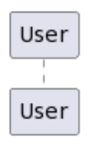
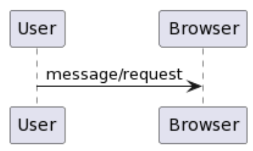
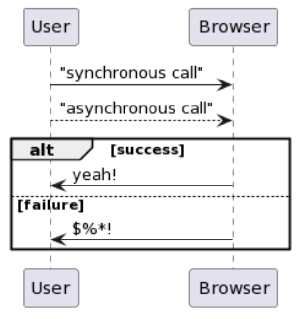
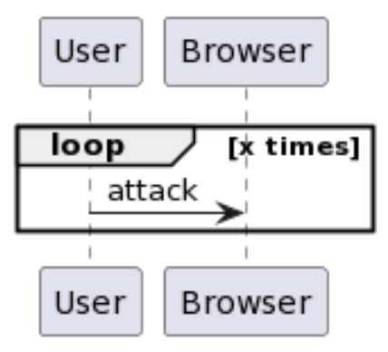

# Overview

In this activity, you will be provided with a somewhat vague use case description. Your task is to interpret the description and create a sequence diagram that accurately represents the process outlined in the use case.

# Thyago's PlantUML Cheat Sheet 

```
participant User
```



```
participant User
participant Browser

User -> Browser: message/request
```



```
participant User
participant Browser

User -> Browser: "synchronous call"

User --> Browser: "asynchronous call"

alt success
  Browser -> User: yeah!
else failure
  Browser -> User: $%*!
end
```



```
participant User
participant Browser

loop x times
    User -> Browser: attack
end
```



```
participant User
participant Browser

User -> Browser: message/request

note right
Let's be clear about this message/request...
end note 
```

# Scenario 1

A user sends a request to the "Flights API" via the "/flights" endpoint, including the following parameters: API access token, flight date, origin, and destination. If the access token is valid, the API server queries the database for flights that match the specified criteria. The server then constructs a JSON response containing the available flights and returns it to the user. If the access token is invalid, the server instead builds a JSON response explaining why the request could not be fulfilled and sends it back to the user.

Participants: User, Flights API, Database
Hint: API requests are asynchronous, while database queries are typically synchronous.  

# Scenario 2

A web application allows users to reserve rooms in a building. Authenticated users submit reservation requests to the web server, including details such as room number, reservation date, and start and end times. The web server checks room availability by querying the database. If the room is available, the server prompts the user to confirm the reservation. Once confirmed, the room is reserved. If the room is not available, the server informs the user accordingly.

Participants: User, Browser, Web Server, Database
